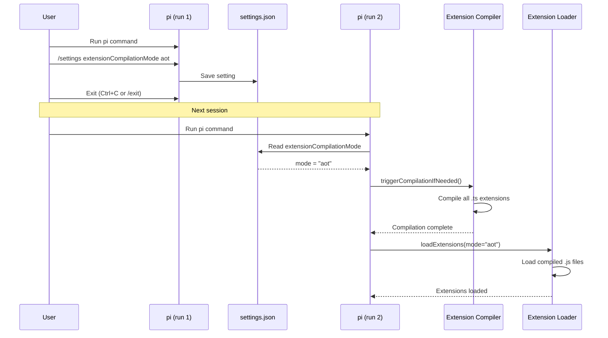
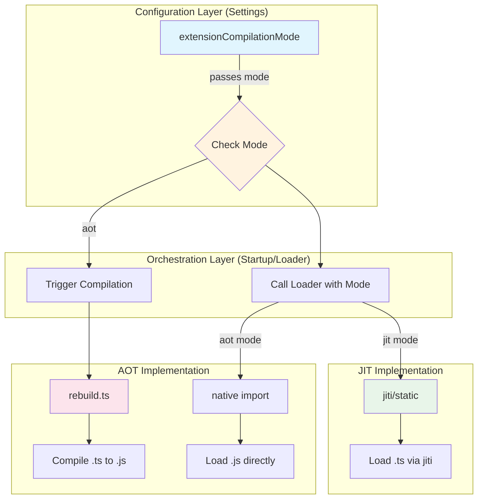
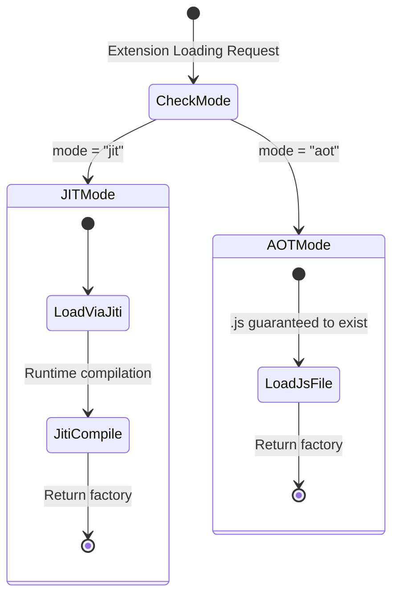

# Extension Compilation Mode Configuration Implementation Plan

## Overview

Add a configuration setting to switch between JIT (jiti) and AOT compilation modes for TypeScript extensions. The design prioritizes **separation of concerns** so the compilation mode setting is decoupled from the JIT/AOT implementation, enabling easy upstream merges when the architecture changes.

## Current State Analysis

### Existing Implementation:

1. **Extension Loader** (`packages/coding-agent/src/core/extensions/loader.ts`):
   - Uses `jiti` for JIT compilation
   - Has AOT fallback logic (checks for `build/` directory)
   - Falls back to jiti if AOT not available

2. **AOT Compilation** (`packages/coding-agent/src/core/extensions/rebuild.ts`):
   - `rebuildExtensions()` function compiles TypeScript to JavaScript
   - Creates `build/` directory with compiled output

3. **Settings System** (`packages/coding-agent/src/core/settings-manager.ts`):
   - Well-structured settings interface
   - Global and project-level settings

### Key Architectural Insight:

The compilation mode setting should be a **thin configuration layer** that controls:
1. What happens at startup (compile or not)
2. Which loader path to use (jiti or native import)

The actual JIT/AOT implementations should remain independent modules that can change without affecting the configuration.

## Desired End State

### Two Modes:

| Mode | Startup Behavior | Extension Loading |
|------|------------------|-------------------|
| `jit` | No compilation | Always use jiti |
| `aot` | Auto-compile all `.ts` extensions | Use compiled `.js` files only |

### User Workflow:



### Separation of Concerns:



## What We're NOT Doing

- **Not** adding a "default" mode - just `jit` or `aot`
- **Not** modifying the jiti library itself
- **Not** changing the AOT compilation implementation
- **Not** adding automatic recompilation on file changes
- **Not** mixing configuration with implementation details

## Implementation Approach

Create a clean separation where:
1. **Settings** only store the mode preference
2. **Startup** reads the mode and triggers appropriate actions
3. **Loader** receives a pre-determined loading strategy
4. **JIT/AOT implementations** remain independent and swappable

---

## Phase 1: Add Setting to Settings Interface

### Overview
Add the `extensionCompilationMode` setting - a simple string enum with no logic.

### Changes Required:

#### 1. Add Type Definition
**File**: `packages/coding-agent/src/core/settings-manager.ts`

```typescript
// Add after line 80 (after existing type definitions)
export type ExtensionCompilationMode = "jit" | "aot";
```

#### 2. Add to Settings Interface
**File**: `packages/coding-agent/src/core/settings-manager.ts`

```typescript
// Add to Settings interface (around line 100)
export interface Settings {
  // ... existing fields ...
  extensionCompilationMode?: ExtensionCompilationMode;
}
```

#### 3. Add Getter Method
**File**: `packages/coding-agent/src/core/settings-manager.ts`

```typescript
// Add after other getters (around line 500)
getExtensionCompilationMode(): ExtensionCompilationMode {
  return this.settings.extensionCompilationMode ?? "jit";  // Default to jit for backward compat
}
```

#### 4. Add Setter Method
**File**: `packages/coding-agent/src/core/settings-manager.ts`

```typescript
// Add after getter
setExtensionCompilationMode(mode: ExtensionCompilationMode): void {
  this.globalSettings.extensionCompilationMode = mode;
  this.markModified("extensionCompilationMode");
  this.save();
}
```

### Success Criteria:

#### Automated Verification:
- [ ] TypeScript compilation: `npm run check`
- [ ] Existing tests pass: `./test.sh`

#### Manual Verification:
- [ ] Setting can be read via `settingsManager.getExtensionCompilationMode()`
- [ ] Default value is "jit"

**Implementation Note**: Complete this phase and verify before proceeding.

---

## Phase 2: Add Compilation Trigger at Startup (Fail-Fast)

### Overview
When pi starts in AOT mode, automatically compile all extensions BEFORE loading. If compilation fails, pi exits immediately with a clear error.

### Key Design Principle:
**Fail-fast at startup** - if compilation fails, don't start. By the time the loader runs, `.js` files are guaranteed to exist.

### Changes Required:

#### 1. Create Compilation Trigger Module
**File**: `packages/coding-agent/src/core/extensions/compilation-trigger.ts` (NEW)

```typescript
/**
 * Compilation trigger - handles automatic extension compilation.
 * 
 * This module is RESPONSIBLE FOR:
 * - Detecting if compilation is needed
 * - Triggering compilation when mode changes
 * - Failing fast if compilation fails
 * 
 * This module is NOT RESPONSIBLE FOR:
 * - The actual compilation (delegated to rebuild.ts)
 * - Loading extensions (delegated to loader.ts)
 * - Knowing about jiti (that's loader's concern)
 */

import type { SettingsManager } from "../settings-manager.ts";
import { rebuildExtensions } from "./rebuild.ts";

export interface CompilationTriggerOptions {
  settingsManager: SettingsManager;
  cwd: string;
  agentDir: string;
}

/**
 * Check if extensions need compilation based on current mode.
 */
export function needsCompilation(settingsManager: SettingsManager): boolean {
  return settingsManager.getExtensionCompilationMode() === "aot";
}

/**
 * Trigger compilation of all extensions.
 * Called once at startup when in AOT mode.
 * Throws if compilation fails (fail-fast).
 */
export async function triggerCompilationIfNeeded(
  options: CompilationTriggerOptions
): Promise<boolean> {
  const { settingsManager, cwd, agentDir } = options;
  
  if (!needsCompilation(settingsManager)) {
    return false;
  }
  
  console.log("[AOT] Compilation mode enabled, compiling extensions...");
  
  try {
    await rebuildExtensions(settingsManager, cwd, agentDir);
    console.log("[AOT] Extension compilation complete");
    return true;
  } catch (error) {
    console.error("[AOT] Extension compilation failed:", error);
    // Fail-fast: throw to prevent startup
    throw new Error(
      `Extension compilation failed in AOT mode. ` +
      `Fix the error above or change extensionCompilationMode to "jit".`
    );
  }
}
```

#### 2. Integrate at Application Startup
**File**: `packages/coding-agent/src/cli.ts` or appropriate startup location

```typescript
// Import the trigger
import { triggerCompilationIfNeeded } from "./core/extensions/compilation-trigger.ts";

// At startup, after SettingsManager is created
async function startApplication() {
  // ... existing initialization ...
  
  const settingsManager = SettingsManager.create(cwd, agentDir);
  
  // Trigger compilation if in AOT mode (fail-fast if it fails)
  await triggerCompilationIfNeeded({
    settingsManager,
    cwd,
    agentDir,
  });
  
  // ... continue with normal startup (extensions will find .js files) ...
}
```

### Success Criteria:

#### Automated Verification:
- [ ] TypeScript compilation: `npm run check`
- [ ] Existing tests pass: `./test.sh`

#### Manual Verification:
- [ ] Starting pi with `extensionCompilationMode: "jit"` does NOT trigger compilation
- [ ] Starting pi with `extensionCompilationMode: "aot"` triggers compilation
- [ ] If compilation fails, pi exits immediately with clear error message

**Implementation Note**: Complete this phase and verify before proceeding.

---

## Phase 3: Modify Extension Loader to Respect Mode

### Overview
The loader receives the mode and uses the appropriate loading strategy. In AOT mode, no error checking is needed - compilation already happened at startup.

### Key Design Principle:

The loader should NOT know about settings. It receives the mode as a parameter, keeping concerns separated.

### Loading Strategy State Diagram:



**Key Insight**: In AOT mode, compilation happens at startup BEFORE any extension loading. If compilation fails, pi exits immediately. By the time the loader runs, `.js` files are guaranteed to exist. No error handling needed in the loader.

### Changes Required:

#### 1. Update Loader Function Signature
**File**: `packages/coding-agent/src/core/extensions/loader.ts`

```typescript
// Update loadExtensionModule signature (around line 310)
export async function loadExtensionModule(
  extensionPath: string,
  cacheToken?: ExtensionCacheToken,
  compilationMode: "jit" | "aot" = "jit"  // Default to jit
) {
  // ... existing code ...
}
```

#### 2. Modify Loading Logic
**File**: `packages/coding-agent/src/core/extensions/loader.ts`

```typescript
export async function loadExtensionModule(
  extensionPath: string,
  cacheToken?: ExtensionCacheToken,
  compilationMode: "jit" | "aot" = "jit"
) {
  console.log(`[Ldr] Loading module: ${extensionPath} (mode: ${compilationMode})`);
  
  // ... existing cache check ...
  
  // AOT MODE: Load compiled .js files (guaranteed to exist after startup compilation)
  if (compilationMode === "aot") {
    if (extensionPath.endsWith(".js")) {
      // Already .js, load directly
      return await loadJsModule(extensionPath, cacheToken);
    }
    
    if (extensionPath.endsWith(".ts")) {
      // Find and load compiled .js version
      // No error check needed - compilation happened at startup
      const compiledPath = getCompiledPath(extensionPath);
      return await loadJsModule(compiledPath, cacheToken);
    }
  }
  
  // JIT MODE: Always use jiti (current behavior)
  if (compilationMode === "jit") {
    return await loadViaJiti(extensionPath, cacheToken);
  }
  
  // Fallback (shouldn't reach here)
  throw new Error(`Unknown compilation mode: ${compilationMode}`);
}

// Helper: Load .js module via native import
async function loadJsModule(jsPath: string, cacheToken?: ExtensionCacheToken) {
  const startTime = performance.now();
  try {
    const module = await import(`${jsPath}?t=${Date.now()}`);
    const endTime = performance.now();
    console.log(`[AOT] ${jsPath} loaded in ${endTime - startTime}ms`);
    const factory = (module.default || module) as ExtensionFactory;
    if (typeof factory === "function") {
      if (isCurrentCacheToken(cacheToken)) {
        extensionCache.set(jsPath, factory);
      }
      return factory;
    }
  } catch (err) {
    console.warn(`[AOT] Native import failed for ${jsPath}: ${err}`);
    throw err;
  }
  return undefined;
}

// Helper: Load via jiti (JIT mode)
async function loadViaJiti(extensionPath: string, cacheToken?: ExtensionCacheToken) {
  const jiti = createJiti(import.meta.url, {
    moduleCache: false,
    ...(isBunBinary ? { virtualModules: VIRTUAL_MODULES, tryNative: false } : { alias: getAliases() }),
  });

  const module = await jiti.import(extensionPath, { default: true });
  const factory = module as ExtensionFactory;
  if (typeof factory !== "function") {
    return undefined;
  }
  if (isCurrentCacheToken(cacheToken)) {
    extensionCache.set(extensionPath, factory);
  }
  return factory;
}

// Helper: Get compiled path for .ts file
function getCompiledPath(tsPath: string): string | null {
  const extDir = path.dirname(tsPath);
  
  // Find package root
  let packageRoot = extDir;
  while (packageRoot !== path.parse(packageRoot).root) {
    if (fs.existsSync(path.join(packageRoot, "package.json"))) {
      break;
    }
    packageRoot = path.dirname(packageRoot);
  }
  
  const buildDir = path.join(packageRoot, "build");
  const relativePath = path.relative(packageRoot, tsPath);
  return path.join(buildDir, relativePath.replace(/\.ts$/, ".js"));
}
```

### Success Criteria:

#### Automated Verification:
- [ ] TypeScript compilation: `npm run check`
- [ ] All tests pass: `./test.sh`
- [ ] AOT compilation test: `node ../../node_modules/vitest/dist/cli.js --run test/aot-compile.test.ts`

#### Manual Verification:
- [ ] JIT mode loads extensions via jiti (check console logs)
- [ ] AOT mode loads compiled .js files (check console logs)

**Implementation Note**: Complete this phase and verify before proceeding.

---

## Phase 4: Update Callers to Pass Compilation Mode

### Overview
All entry points that load extensions need to pass the compilation mode.

### Changes Required:

#### 1. Identify All Entry Points
Search for calls to:
- `loadExtensions()`
- `loadExtensionsCached()`
- `discoverAndLoadExtensions()`

#### 2. Update Each Caller
**Files**: Various files throughout the codebase

```typescript
// Pattern for updating callers:
const compilationMode = settingsManager.getExtensionCompilationMode();
const result = await discoverAndLoadExtensions(
  extensionPaths,
  cwd,
  agentDir,
  eventBus,
  compilationMode  // Add this parameter
);
```

### Success Criteria:

#### Automated Verification:
- [ ] TypeScript compilation: `npm run check`
- [ ] All tests pass: `./test.sh`

#### Manual Verification:
- [ ] All extension loading respects the setting

---

## Phase 5: Add Settings Display Command

### Overview
Show the current compilation mode in the `/settings` command.

### Changes Required:

#### 1. Update Settings Display
**File**: `packages/coding-agent/src/modes/interactive/commands/settings.ts`

```typescript
// In the settings display logic
"Extension Compilation Mode": settingsManager.getExtensionCompilationMode(),
```

#### 2. Add Settings Change Handler
**File**: `packages/coding-agent/src/modes/interactive/commands/settings.ts`

```typescript
// Handle setting change
case "extensionCompilationMode":
  if (value === "jit" || value === "aot") {
    settingsManager.setExtensionCompilationMode(value);
  } else {
    throw new Error("Invalid value. Must be 'jit' or 'aot'");
  }
  break;
```

### Success Criteria:

#### Automated Verification:
- [ ] TypeScript compilation: `npm run check`
- [ ] Tests pass: `./test.sh`

#### Manual Verification:
- [ ] `/settings` shows current compilation mode
- [ ] Can change mode via `/settings` command
- [ ] Change persists to settings.json

---

## Testing Strategy

### Unit Tests:

1. **Settings Manager** (`packages/coding-agent/test/settings-manager.test.ts`):
   ```typescript
   describe("extensionCompilationMode", () => {
     it("defaults to jit", () => {
       const manager = SettingsManager.inMemory();
       expect(manager.getExtensionCompilationMode()).toBe("jit");
     });
     
     it("can be set to aot", () => {
       const manager = SettingsManager.inMemory();
       manager.setExtensionCompilationMode("aot");
       expect(manager.getExtensionCompilationMode()).toBe("aot");
     });
   });
   ```

2. **Compilation Trigger** (`packages/coding-agent/test/compilation-trigger.test.ts`):
   ```typescript
   describe("triggerCompilationIfNeeded", () => {
     it("does not trigger in jit mode", async () => {
       const manager = SettingsManager.inMemory({ extensionCompilationMode: "jit" });
       const triggered = await triggerCompilationIfNeeded({ settingsManager: manager, ... });
       expect(triggered).toBe(false);
     });
     
     it("triggers in aot mode", async () => {
       const manager = SettingsManager.inMemory({ extensionCompilationMode: "aot" });
       // Mock rebuildExtensions
       const triggered = await triggerCompilationIfNeeded({ settingsManager: manager, ... });
       expect(triggered).toBe(true);
     });
     
     it("throws on compilation failure", async () => {
       const manager = SettingsManager.inMemory({ extensionCompilationMode: "aot" });
       // Mock rebuildExtensions to throw
       await expect(
         triggerCompilationIfNeeded({ settingsManager: manager, ... })
       ).rejects.toThrow("compilation failed");
     });
   });
   ```

3. **Extension Loader** (`packages/coding-agent/test/aot-compile.test.ts`):
   ```typescript
   describe("loadExtensionModule with compilationMode", () => {
     it("uses jiti in jit mode", async () => {
       const factory = await loadExtensionModule(tsPath, undefined, "jit");
       expect(factory).toBeDefined();
     });
     
     it("uses compiled js in aot mode", async () => {
       // Ensure compiled version exists
       const factory = await loadExtensionModule(tsPath, undefined, "aot");
       expect(factory).toBeDefined();
     });
   });
   ```

### E2E Testing with shell-use:

All manual tests below use `shell-use` for automated terminal interaction.

#### Test 1: JIT Mode (Default)
```bash
# Setup
shell-use close --all 2>/dev/null || true
shell-use open --cols 80 --rows 30

# Create test extension
shell-use submit "mkdir -p ~/.pi/agent/extensions"
shell-use wait command
shell-use submit "echo 'export default async function(pi) { console.log(\"test\"); }' > ~/.pi/agent/extensions/test.ts"
shell-use wait command

# Run pi and verify JIT mode
shell-use submit "pi"
shell-use wait text "π"
shell-use expect text "(mode: jit)" --timeout 10000
shell-use expect text "Extension loaded"

# Exit
shell-use submit "/exit"
shell-use wait exit
shell-use close
```

#### Test 2: Switch to AOT Mode via /settings
```bash
# Setup
shell-use close --all 2>/dev/null || true
shell-use open --cols 80 --rows 30

# Run pi
shell-use submit "pi"
shell-use wait text "π"

# Change setting to aot
shell-use submit "/settings extensionCompilationMode aot"
shell-use wait text "extensionCompilationMode"
shell-use expect text "aot"

# Exit
shell-use submit "/exit"
shell-use wait exit

# Run pi again - should trigger compilation
shell-use submit "pi"
shell-use wait text "π"
shell-use expect text "[AOT] Compiling extensions..." --timeout 30000
shell-use expect text "[AOT] Extension compilation complete"
shell-use expect text "[AOT] ... loaded in" --timeout 10000

# Exit
shell-use submit "/exit"
shell-use wait exit
shell-use close
```

#### Test 3: AOT Mode Without Compilation (Fail-Fast)
```bash
# Setup
shell-use close --all 2>/dev/null || true
shell-use open --cols 80 --rows 30

# Set mode to aot directly in settings.json
shell-use submit "mkdir -p ~/.pi/agent"
shell-use wait command
shell-use submit "echo '{\"extensionCompilationMode\": \"aot\"}' > ~/.pi/agent/settings.json"
shell-use wait command

# Create new uncompiled extension
echo 'export default async function(pi) { console.log("new"); }' > ~/.pi/agent/extensions/new.ts

# Run pi - should fail fast with compilation error
shell-use submit "pi"
shell-use expect text "Extension compilation failed" --timeout 30000
shell-use expect exit-code 1

shell-use close
```

#### Test 4: AOT Mode with Compiled Extension
```bash
# Setup
shell-use close --all 2>/dev/null || true
shell-use open --cols 80 --rows 30

# Compile extensions first
shell-use submit "pi extensions rebuild"
shell-use wait command --timeout 60000
shell-use expect exit-code 0

# Set mode to aot
shell-use submit "echo '{\"extensionCompilationMode\": \"aot\"}' > ~/.pi/agent/settings.json"
shell-use wait command

# Run pi - should load from compiled .js
shell-use submit "pi"
shell-use wait text "π"
shell-use expect text "[AOT] ... loaded in" --timeout 10000

# Exit
shell-use submit "/exit"
shell-use wait exit
shell-use close
```

#### Test 5: Verify Settings Persistence
```bash
# Setup
shell-use close --all 2>/dev/null || true
shell-use open --cols 80 --rows 30

# Set mode to aot
shell-use submit "echo '{\"extensionCompilationMode\": \"aot\"}' > ~/.pi/agent/settings.json"
shell-use wait command

# Run pi and check settings
shell-use submit "pi"
shell-use wait text "π"
shell-use submit "/settings"
shell-use wait text "extensionCompilationMode"
shell-use expect text "aot"

# Exit
shell-use submit "/exit"
shell-use wait exit
shell-use close
```

### Manual Verification (Non-automated):

- [ ] Extension loads correctly with JIT mode
- [ ] Extension loads correctly with AOT mode after compilation
- [ ] Clear error message when AOT mode fails
- [ ] Setting persists across pi restarts
- [ ] Upstream merges don't break the setting

---

## Performance Considerations

| Mode | Startup Time | Extension Load Time | Memory |
|------|--------------|---------------------|--------|
| `jit` | Fast (no compilation) | Slower (runtime compilation) | Higher (jiti cache) |
| `aot` | Slower (compilation) | Faster (native import) | Lower |

**Note**: AOT compilation only happens once per startup when mode is "aot". Subsequent loads use cached compiled files.

---

## Migration Notes

- **Backward Compatible**: Default mode is "jit" (current behavior)
- **No Breaking Changes**: Existing extensions work without modification
- **Optional Setting**: Users only need to configure if they want AOT mode

---

## Upstream Merge Strategy

### Design Principles for Easy Merging:

1. **Settings Layer is Isolated**:
   - `extensionCompilationMode` is just a string field
   - No logic in settings-manager.ts related to JIT/AOT
   - Merge conflicts unlikely in settings

2. **Loader Changes are Minimal**:
   - Only add `compilationMode` parameter
   - Keep existing logic intact
   - Extract helpers (loadJsModule, loadViaJiti) for clarity

3. **JIT Implementation is Swappable**:
   - jiti usage is isolated in `loadViaJiti()`
   - If jiti is replaced, only this function changes
   - Configuration layer unaffected

4. **AOT Implementation is Swappable**:
   - AOT compilation is in `rebuild.ts`
   - If AOT tooling changes, only rebuild.ts changes
   - Configuration layer unaffected

### Merge Conflict Prevention:

- Settings interface changes are additive (new field)
- Loader changes are parameter additions
- New module (`compilation-trigger.ts`) is separate file
- Existing functions get optional parameters with defaults

---

## References

- Extension Loader: `packages/coding-agent/src/core/extensions/loader.ts`
- Settings Manager: `packages/coding-agent/src/core/settings-manager.ts`
- AOT Compilation: `packages/coding-agent/src/core/extensions/rebuild.ts`
- AOT Tests: `packages/coding-agent/test/aot-compile.test.ts`
- CLI Entry: `packages/coding-agent/src/cli.ts`
